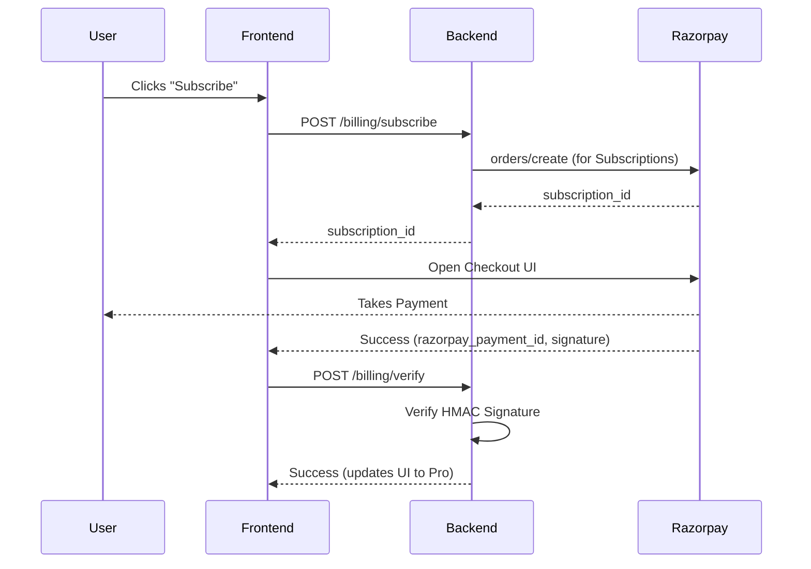
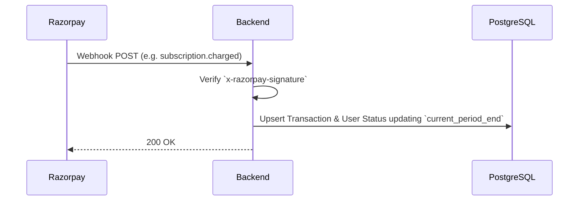

# Project Research: Architecture

## Architectural Boundaries

### 1. Plan Management (Initialization)
- Backend API must check Razorpay API to see if `Kortex Pro` plan exists.
- If missing, standardizes a Node.js singleton or initialization script to create it dynamically avoiding manual syncs securely.

### 2. Client-Server Flow 

### 3. Server-Server Flow (Webhooks)

## Recommended Build Order
1. Setup local env vars mapping Razorpay Sandbox keys.
2. Initialize Backend API Endpoints (Plan check, Subscription Create).
3. Extend Drizzle PostgreSQL Schemas to support tracking values.
4. Setup Frontend hook + Razorpay UI component.
5. Create logic for Verification APIs and Webhooks endpoints. 
6. Map `Resend` emails to the Webhook handlers. 
